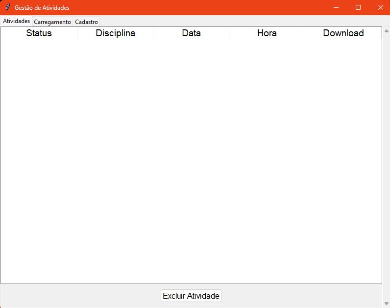
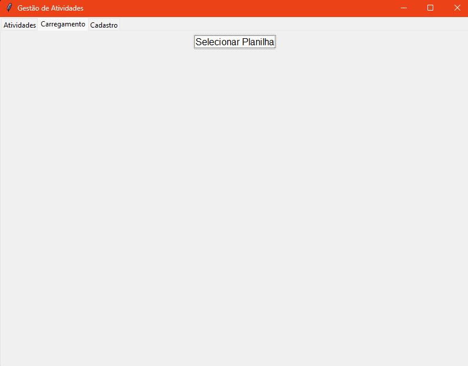
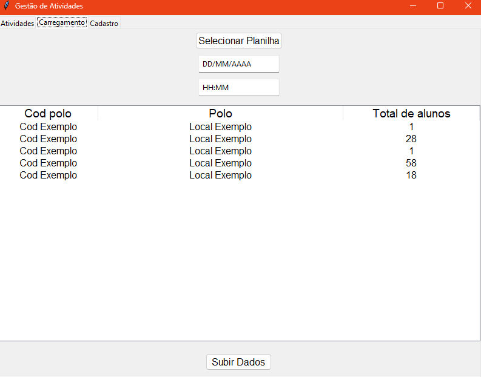
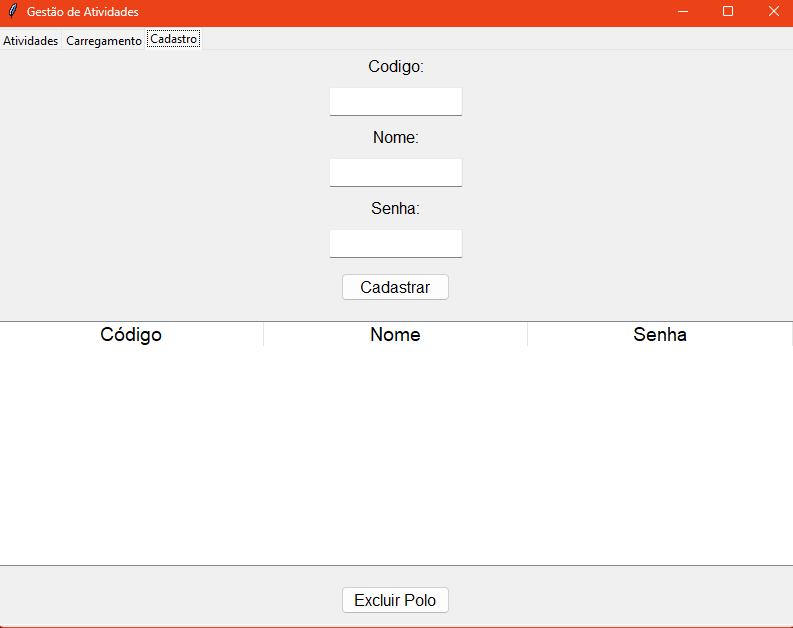

# O que é este Projeto?
StudentPresence é um sistema de gerenciamento de presença de alunos, dividido em duas partes independentes: Admin e User.

### Admin:
O administrador pode cadastrar alunos utilizando uma planilha.
Os alunos são associados a atividades específicas, cada uma com um prazo e horário definidos.
### User:
Os usuários podem acessar um programa secundário para visualizar uma lista de todos os alunos cadastrados e vinculados ao seu acesso.
Os usuários devem marcar a presença dos alunos que compareceram às atividades.

# Sobre esse Repositório:
Este repositório contém a parte administrativa do sistema e funciona de forma completamente independente do módulo de usuário. Sinta-se à vontade para clonar, modificar e utilizar o código conforme necessário. Esforcei-me para escrever o código da forma mais limpa possível, o que facilita a personalização e adaptação para atender aos seus objetivos.

# Como posso utilizar ele?
Siga os seguintes passos para que consiga vizualizar bem:
- Instale todas os modulos.
- Execute db_requests.py pela primeira vez para criar um banco de dados local de testes para armazenar seus dados. O arquivo já está configurado para que você possa usar essa mesma configuração em qualquer outro código.
- Agora pode executar o 'app.py'. 
- O programa vai mostrar a seguinte tela:
- Veja que ele possui 3 abas, "Atividades", "Carregamento" e "Cadastro". 
- Atividades: Exibe todas as atividades já cadastradas, com a opção de excluir cada uma delas.

- Carregamento: Inicialmente, será exibida uma tela com uma única opção para importar uma planilha.

- A planilha deve seguir o padrão e nomenclatura exatos conforme indicado:

- Após importar a planilha, o programa coletará os dados e organizará tudo conforme a imagem:

- Ao clicar em "Subir Dados", o cadastramento da atividade será concluído.
- Cadastro: Cria um acesso para um polo, desde que o nome e o código correspondam a algum dos registrados na planilha. Isso permitirá o acesso à aplicação para o registro de presenças.

# Tecnologias Utilizadas:
-  Sqlite3 
-  Qt (Tkinter)
-  Pandas

# Status do Projeto:
- Em andamento.
